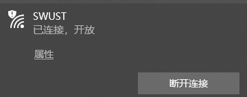
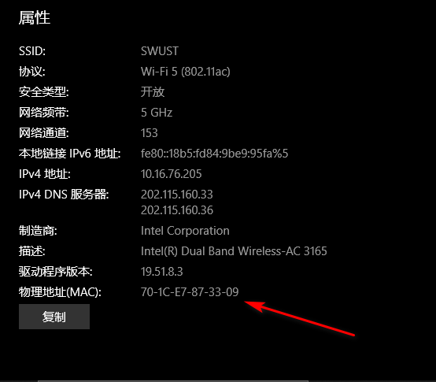

# IOTAT签到系统使用方式

TIP：当前是系统测试模式，出现BUG请及时与管理员联系或提交issues进行说明

## 1、查看本机mac地址

点击

此按钮，在已连接的WiFi下点击“属性”，如下

然后该界面就有你自己的mac地址了，如下所示

## 2、注册账号

在连接了校园网的环境下，访问 http://10.10.5.130:18887/ 即可进入登录注册界面（注意：登录界面在测试阶段无法使用，请直接跳转到注册界面）

然后根据提示输入自己的个人信息

点击注册，提示成功即注册完成

## 3、下载客户端

下载地址：https://github.com/Dreamcreationman/iotat_checkin_client/releases/download/V1.0/IOTAT.zip

## 4、安装客户端，并设置为开机自启

安装就正常步骤安装就好了，运行以后可以在Windows托盘处看到程序图标

右键程序，选择`setAutorun'即可设置开机自启

程序运行后自动记录签到时间，测试版暂时无法查看自己的在线时间，如需查看，清和管理员联系